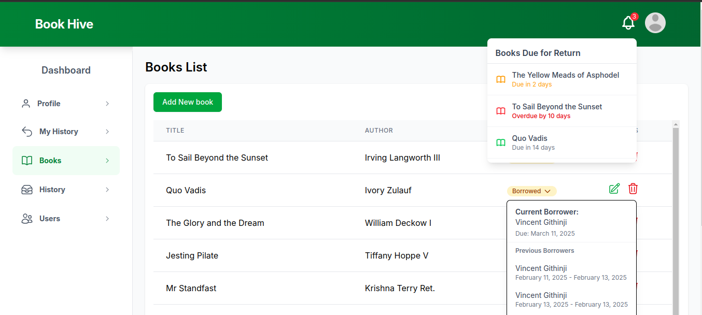

# Book Hive
A book lending library application built with Ruby on Rails 8, MySQL database and deployed using Kamal.

## Pre-requisites
- Ruby (version 3.4.1 or newer)
- Rails (version 8.0.1 or newer)
- MySQL (version 8.4 or newer)

## Setup
1. Clone the repository
2. Install dependencies by running ```bundle install``` and ```yarn install```
3. Setup the database by running ```./bin/rails db:setup```
4. Run ```./bin/rails db:seed``` to generate some books data
5. Start the server by running ```./bin/dev``` and visit [http://localhost:3000](http://localhost:3000)
6. You will be redirected to the sign in page. Click the sign up button and fill in your details then submit.

## Features
- User registration and login using rails 8 authentication
- Browse available books
- Borrow and return books
- View currently borrowed books

## Librarian (Admin) Features
- View all users
- View borrowed books
- View currently borrowed books
- View borrowing history

## Librarian (Admin) Dashboard



## Tests
- Run ```bin/rails db:test:prepare test test:system``` to test the app.

## Demo
- Check out the demo deployed using Kamal [here](https://bookhive.kachistore.online)

